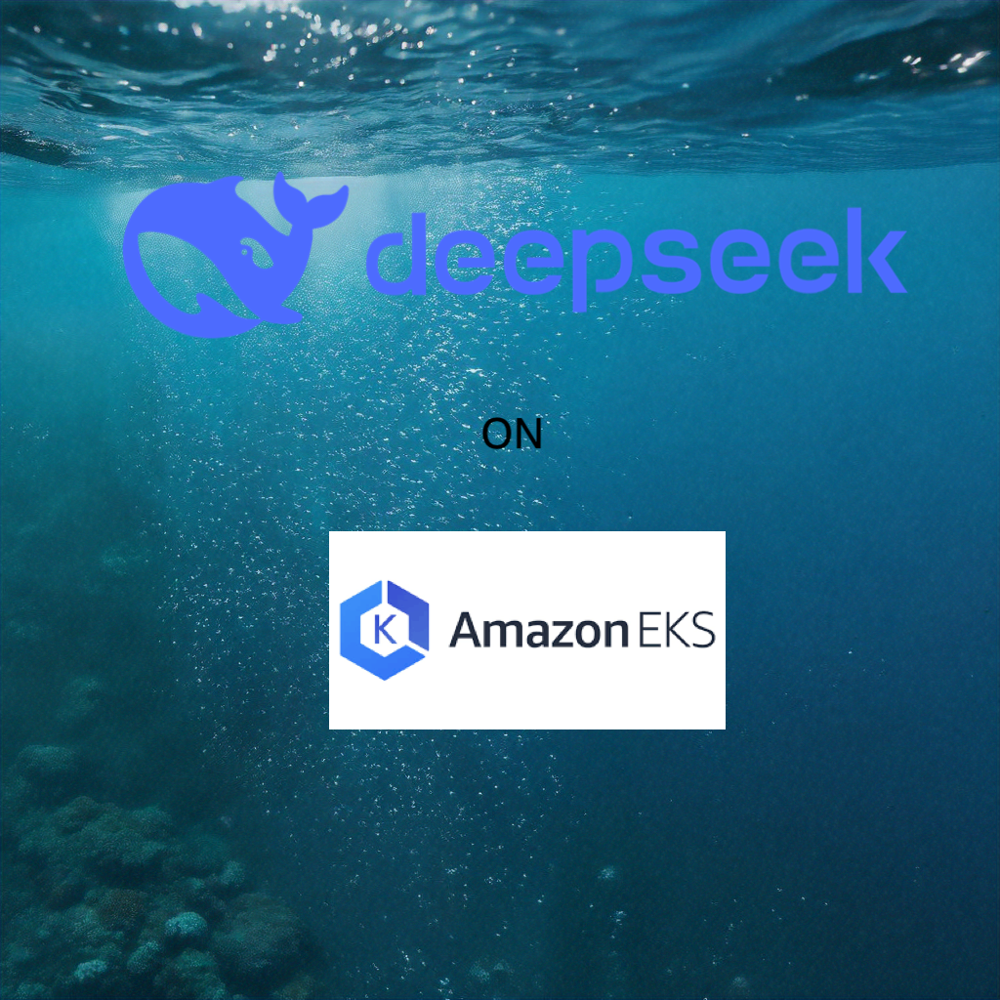
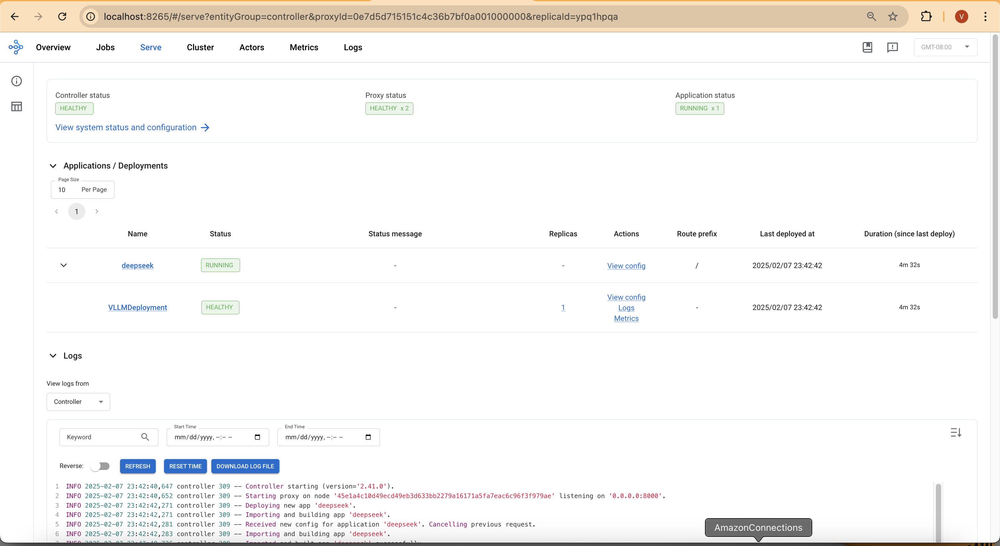
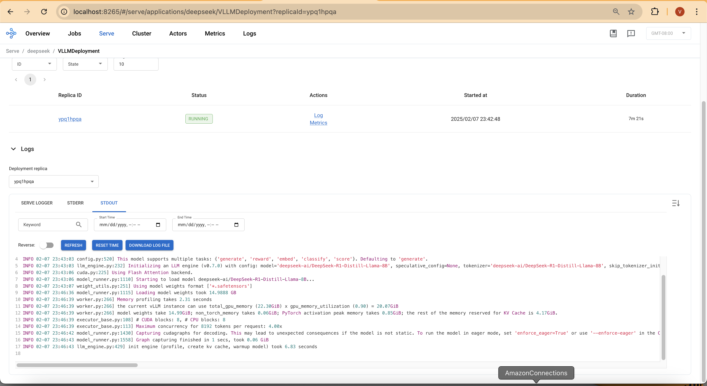
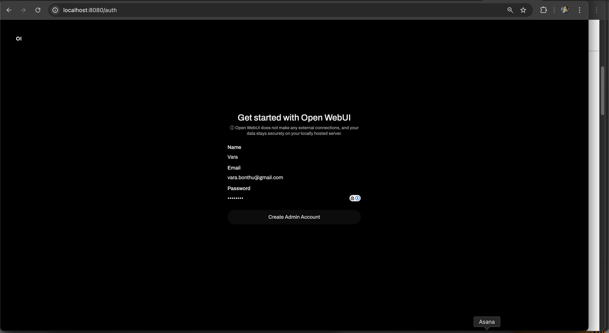
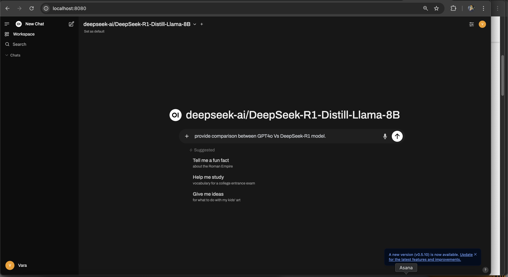
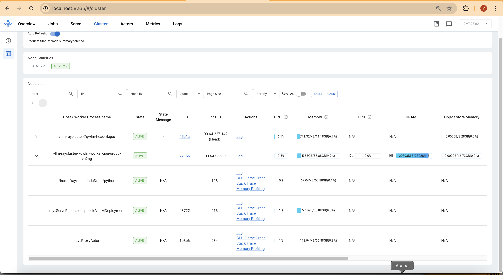

import CollapsibleContent from '../../../../src/components/CollapsibleContent';

# DeepSeek-R1 on EKS with Ray and vLLM

In this guide, we'll explore deploying [DeepSeek-R1-Distill-Llama-8B](https://huggingface.co/deepseek-ai/DeepSeek-R1-Distill-Llama-8B) model inference using [Ray](https://docs.ray.io/en/latest/serve/getting_started.html) with a [vLLM](https://github.com/vllm-project/vllm) backend on [Amazon EKS](https://aws.amazon.com/eks/).



## Understanding the GPU Memory Requirements

Deploying an 8B parameter model like `DeepSeek-R1-Distill-Llama` requires careful memory planning. Each model parameter typically consumes 2 bytes (`BF16` precision), meaning the full model weights require around `14.99 GiB` GPU memory. Below is the actual memory usage observed during deployment:

Log sample from Ray deployment

```log
INFO model_runner.py:1115] Loading model weights took 14.99 GiB
INFO worker.py:266] vLLM instance can use total GPU memory (22.30 GiB) x utilization (0.90) = 20.07 GiB
INFO worker.py:266] Model weights: 14.99 GiB | Activation memory: 0.85 GiB | KV Cache: 4.17 GiB
```

G5 instances provide single `A10G` GPUs with `24 GiB` memory, ideal for running one large LLM inference process per instance. For this deployment, we use `G5.4xlarge`, which has 1x NVIDIA A10G GPU (24 GiB), 16 vCPUs and 64 GiB RAM.

Using vLLM, we optimize memory utilization, enabling us to maximize inference speed while preventing out-of-memory (OOM) crashes.


<CollapsibleContent header={<h2><span>Deploying EKS Cluster and Addons</span></h2>}>

Our tech stack includes:

- [Amazon EKS](https://aws.amazon.com/eks/) – A managed Kubernetes service that simplifies deploying, managing, and scaling containerized applications using Kubernetes on AWS.

- [Ray](https://docs.ray.io/en/latest/serve/getting_started.html) – An open-source distributed computing framework that enables scalable and efficient execution of machine learning inference workloads.

- [vLLM](https://github.com/vllm-project/vllm) – A high-throughput and memory-efficient inference and serving engine for large language models (LLMs), optimized for GPU execution.
AWSLABS.GITHUB.IO

- [Karpenter](https://karpenter.sh/) – An open-source Kubernetes cluster autoscaler that dynamically provisions and manages compute resources, such as G5 instances, to improve application availability and cluster efficiency


### Prerequisites
Before we begin, ensure you have all the necessary prerequisites in place to make the deployment process smooth. Make sure you have installed the following tools on your machine:

:::info

To simplify the demo process, we assume the use of an IAM role with administrative privileges due to the complexity of creating minimal IAM roles for each blueprint that may create various AWS services. However, for production deployments, it is strongly advised to create an IAM role with only the necessary permissions. Employing tools such as [IAM Access Analyzer](https://aws.amazon.com/iam/access-analyzer/) can assist in ensuring a least-privilege approach.

:::

1. [aws cli](https://docs.aws.amazon.com/cli/latest/userguide/install-cliv2.html)
2. [kubectl](https://Kubernetes.io/docs/tasks/tools/)
3. [terraform](https://learn.hashicorp.com/tutorials/terraform/install-cli)
4. [envsubst](https://pypi.org/project/envsubst/)

### Deploy

Clone the repository

```bash
git clone https://github.com/awslabs/ai-on-eks.git
```

**Important Note:**

**Step1**: Ensure that you update the region in the `variables.tf` file before deploying the blueprint.
Additionally, confirm that your local region setting matches the specified region to prevent any discrepancies.

For example, set your `export AWS_DEFAULT_REGION="<REGION>"` to the desired region:


**Step2**: Run the installation script.

```bash
cd ai-on-eks/infra/jark-stack/terraform && chmod +x install.sh
```

```bash
./install.sh
```

### Verify the resources

Once the installation finishes, verify the Amazon EKS Cluster.

Creates k8s config file to authenticate with EKS.

```bash
aws eks --region us-west-2 update-kubeconfig --name jark-stack
```

```bash
kubectl get nodes
```

```text
NAME                                           STATUS   ROLES    AGE    VERSION
ip-100-64-118-130.us-west-2.compute.internal   Ready    <none>   3h9m   v1.30.0-eks-036c24b
ip-100-64-127-174.us-west-2.compute.internal   Ready    <none>   9h     v1.30.0-eks-036c24b
ip-100-64-132-168.us-west-2.compute.internal   Ready    <none>   9h     v1.30.0-eks-036c24b
```

Verify the Karpenter autosclaer Nodepools

```bash
kubectl get nodepools
```

```text
NAME                NODECLASS
g5-gpu-karpenter    g5-gpu-karpenter
x86-cpu-karpenter   x86-cpu-karpenter
```

Verify the NVIDIA Device plugin

```bash
kubectl get pods -n nvidia-device-plugin
```
```text
NAME                                                              READY   STATUS    RESTARTS   AGE
nvidia-device-plugin-gpu-feature-discovery-b4clk                  1/1     Running   0          3h13m
nvidia-device-plugin-node-feature-discovery-master-568b49722ldt   1/1     Running   0          9h
nvidia-device-plugin-node-feature-discovery-worker-clk9b          1/1     Running   0          3h13m
nvidia-device-plugin-node-feature-discovery-worker-cwg28          1/1     Running   0          9h
nvidia-device-plugin-node-feature-discovery-worker-ng52l          1/1     Running   0          9h
nvidia-device-plugin-p56jj                                        1/1     Running   0          3h13m
```

Verify [Kuberay Operator](https://github.com/ray-project/kuberay) which is used to create Ray Clusters

```bash
kubectl get pods -n kuberay-operator
```

```text
NAME                                READY   STATUS    RESTARTS   AGE
kuberay-operator-7894df98dc-447pm   1/1     Running   0          9h
```

</CollapsibleContent>

## Deploying DeepSeek-R1-Distill-Llama-8B with RayServe and vLLM

With the EKS cluster deployed and all necessary components in place, we can now proceed with deploying `DeepSeek-R1-Distill-Llama-8B` using `RayServe` and `vLLM`. This guide outlines the steps to export the Hugging Face Hub token, create a Docker image (if required), and deploy the RayServe cluster.

**Step1: Export the Hugging Face Hub Token**

Before deploying the model, you need to authenticate with Hugging Face to access the required model files. Follow these steps:

1. Create a Hugging Face account (if you do not already have one).
2. Generate an access token:
 - Navigate to Hugging Face Settings → Access Tokens.
 - Create a new token with read permissions.
 - Copy the generated token.

3. Export the token as an environment variable in your terminal:

```bash
export HUGGING_FACE_HUB_TOKEN=$(echo -n "Your-Hugging-Face-Hub-Token-Value" | base64)
```

> Note: The token must be base64-encoded before being used in Kubernetes secrets.


**Step2: Create a Docker image**

To deploy the model efficiently, you need a Docker image that includes Ray, vLLM, and Hugging Face dependencies. Follow these steps:

- Use the provided Dockerfile:

```text
gen-ai/inference/vllm-ray-gpu-deepseek/Dockerfile
```

- This Dockerfile is based on a Ray image and includes vLLM and Hugging Face libraries. No additional packages are required for this deployment.

- Build and push the Docker image to Amazon ECR

**OR**

- Use a pre-built image (for PoC deployments):

If you want to skip building and pushing a custom image, you can use the public ECR image:

```public.ecr.aws/data-on-eks/ray-2.41.0-py310-cu118-vllm0.7.0```

> Note: If using a custom image, replace the image reference in the RayServe YAML file with your ECR image URI.


**Step3: Deploy RayServe Cluster**

RayServe cluster is defined in a YAML configuration file that includes multiple resources:
- Namespace for isolating the deployment.
- Secret for securely storing the Hugging Face Hub token.
- ConfigMap containing the serving script (OpenAI-compatible API interface).
- RayServe definition that includes:
  - A Ray head pod deployed on an x86 node.
  - Ray worker pods deployed on GPU instances (g5.4xlarge).

**Deployment Steps**

> Note: Ensure that the image: field in `ray-vllm-deepseek.yml` is correctly set to either your custom ECR image URI or the default public ECR image.

Navigate to the directory containing the RayServe configuration and Apply the configuration using kubectl

```sh
cd cd ai-on-eks/blueprints/inference/vllm-ray-gpu-deepseek/
envsubst < ray-vllm-deepseek.yml | kubectl apply -f -
```

**Output**

```text
namespace/rayserve-vllm created
secret/hf-token created
configmap/vllm-serve-script created
rayservice.ray.io/vllm created
```

**Step4: Monitor the deployment**

To monitor the deployment and check the status of the pods, run:

```bash
kubectl get pod -n rayserve-vllm
```

:::info

Note: The image pull process may take up to 8 minutes on the first deployment. Subsequent updates will leverage the local cache. This can be optimized by building leaner images containing only necessary dependencies.

:::


```text
NAME                                           READY   STATUS            RESTARTS   AGE
vllm-raycluster-7qwlm-head-vkqsc               2/2     Running           0          8m47s
vllm-raycluster-7qwlm-worker-gpu-group-vh2ng   0/1     PodInitializing   0          8m47s
```

This deployment also creates a DeepSeek-R1 service with multiple ports:

- `8265` - Ray Dashboard
- `8000` - DeepSeek-R1 model endpoint


Run the following command to verify the services:

```bash
kubectl get svc -n rayserve-vllm

NAME             TYPE        CLUSTER-IP       EXTERNAL-IP   PORT(S)                                         AGE
vllm             ClusterIP   172.20.208.16    <none>        6379/TCP,8265/TCP,10001/TCP,8000/TCP,8080/TCP   48m
vllm-head-svc    ClusterIP   172.20.239.237   <none>        6379/TCP,8265/TCP,10001/TCP,8000/TCP,8080/TCP   37m
vllm-serve-svc   ClusterIP   172.20.196.195   <none>        8000/TCP                                        37m
```

To access the Ray dashboard, you can port-forward the relevant port to your local machine:

```bash
kubectl -n rayserve-vllm port-forward svc/vllm 8265:8265
```

You can then access the web UI at [http://localhost:8265](http://localhost:8265), which displays the deployment of jobs and actors within the Ray ecosystem.

:::info

Model deploymen takes around 4 mins

:::







## Test the DeepSeek-R1 Model

Now it's time to test the DeepSeek-R1-Distill-Llama-8B chat model.

First, execute a port forward to the `vllm-serve-svc` Service using kubectl:

```bash
kubectl -n rayserve-vllm port-forward svc/vllm-serve-svc 8000:8000
```

**Run a test inference request:**

```sh
curl -X POST http://localhost:8000/v1/chat/completions -H "Content-Type: application/json" -d '{
    "model": "deepseek-ai/DeepSeek-R1-Distill-Llama-8B",
    "messages": [{"role": "user", "content": “Explain about DeepSeek model?”}],
    "stream": false
}'
```

**Response:**

```
{"id":"chatcmpl-b86feed9-1482-4d1c-981d-085651d12813","object":"chat.completion","created":1739001265,"model":"deepseek-ai/DeepSeek-R1-Distill-Llama-8B","choices":[{"index":0,"message":{"role":"assistant","content":"<think>\n\n</think>\n\nDeepSeek is a powerful AI search engine developed by the Chinese Company DeepSeek Inc. It is designed to solve complex STEM (Science, Technology, Engineering, and Mathematics) problems through precise reasoning and efficient computation. The model works bymidtTeX, combining large-scale dataset and strong reasoning capabilities to provide accurate and reliable answers.\n\n### Key Features:\n1. **AI-powered Search**: DeepSeek uses advanced AI techniques to understand and analyze vast amounts of data, providing more accurate and relevant search results compared to traditional search engines.\n2. **Reasoning and Problem-solving**: The model is equipped with strong reasoning capabilities, enabling it to solve complex STEM problems, answer research-level questions, and assist in decision-making.\n3. **Customization**: DeepSeek can be tailored to specific domains or industries, allowing it to be adapted for various use cases such as academic research, business analysis, and technical problem-solving.\n4. **Efficiency**: The model is highly efficient, fast, and scalable, making it suitable for a wide range of applications and handling large-scale data processing tasks.\n5. **Domain Expertise**: It can be trained on domain-specific data and knowledge, making it highly specialized in particular fields like mathematics, programming, or engineering.\n\n### Applications:\n- **Education and Research**: Assisting students and researchers with complex STEM problems and research questions.\n- **Business Analysis**: aiding in market research, data analysis, and strategic decision-making.\n- **Technical Support**: solving technical issues and providing troubleshooting assistance.\n- **Custom Problem Solving**: addressing specific challenges in various fields by leveraging domain-specific knowledge.\n\nDeepSeek is a valuable tool for any individual or organizationengaged in STEM fields or requires advanced AI-powered search and reasoning capabilities.","tool_calls":[]},"logprobs":null,"finish_reason":"stop","stop_reason":null}],"usage":{"prompt_tokens":10,"total_tokens":359,"completion_tokens":349,"prompt_tokens_details":null},"prompt_logprobs":null}%
```

## Deploy Open Web Ui

Now, let's deploy the open-source Open WebUI, which provides a ChatGPT-style chat interface to interact with the DeepSeek model deployed on EKS. Open WebUI will use the model service to send requests and receive responses.

**Deploy Open WebUI**

1. Verify the YAML file `gen-ai/inference/vllm-ray-gpu-deepseek/open-webui.yaml` for Open WebUI. This is deployed as a container in EKS, and it communicates with the model service.
2. Apply the Open WebUI deployment:

```bash
cd gen-ai/inference/vllm-ray-gpu-deepseek/
kubectl apply -f open-webui.yaml
```

**Output:**

```text
namespace/openai-webui created
deployment.apps/open-webui created
service/open-webui created
```

**Accessing the Open WebUI**

To open the web UI, port-forward the Open WebUI service:

```bash
kubectl -n open-webui port-forward svc/open-webui 8080:80
```

Then, open a browser and navigate to: [http://localhost:8080](http://localhost:8080)

You will see a registration page. Register with your name, email, and password.






After submitting a request, you can monitor the GPU and CPU usage returning to normal:




## Key Takeaways

**1. Model Initialization & Memory Allocation**
  - Once deployed, the model automatically detects CUDA and initializes its execution environment.
  - GPU memory is allocated dynamically, with 90% utilization reserved for model weights (14.99 GiB), activation memory (0.85 GiB), and KV Cache (4.17 GiB).
  - Expect some initial delay during the first model load, as weights are fetched and optimized for inference.

 **2. Inference Execution & Optimization**
   - The model supports multiple tasks but defaults to text generation (generate).
   - Flash Attention is enabled, reducing memory overhead and improving inference speed.
   - CUDA Graph Capture is applied, allowing for faster repeated inferences—but if OOM issues arise, decreasing gpu_memory_utilization or enabling eager execution can help.

 **3. Token Generation & Performance Metrics**
  - The model will initially show 0 tokens/sec for prompt throughput, as it waits for input.
  - Once inference starts, token generation throughput stabilizes at ~29 tokens/sec.
  - GPU KV Cache utilization starts at ~12.5% and increases as more tokens are processed—ensuring smoother text generation over time.

**4. System Resource Utilization**
  - Expect 8 CPU and 8 CUDA blocks handling parallel execution.
  - Inference concurrency is limited to 4 requests for 8192 tokens per request, meaning simultaneous requests may be queued if the model is fully utilized.
  - If encountering memory spikes, lowering max_num_seqs will help reduce GPU strain.

**5. Monitoring & Observability**
  - You can track average prompt throughput, generation speed, and GPU KV Cache usage in the logs.
  - If inference slows down, check the logs for pending or swapped requests, which may indicate memory pressure or scheduling delays.
  - Real-time observability (e.g., tracing request latency) is disabled by default, but can be enabled for deeper monitoring.

**What to Expect Post-Deployment?**

- The model will take a few minutes to initialize due to memory profiling and CUDA graph optimization.
- Once running, you should see stable throughput of ~29 tokens/sec with efficient memory usage.
- If performance dips, adjust KV Cache size, decrease memory utilization, or enable eager execution for better stability.

## Cleanup

Finally, we'll provide instructions for cleaning up and deprovisioning the resources when they are no longer needed.

Delete the RayCluster

```bash
cd ai-on-eks/blueprints/inference/vllm-rayserve-gpu

kubectl delete -f open-webui.yaml

kubectl delete -f ray-vllm-deepseek.yml
```

```bash
cd ai-on-eks/infra/jark-stack/terraform/monitoring

kubectl delete -f serviceMonitor.yaml
kubectl delete -f podMonitor.yaml
```

Destroy the EKS Cluster and resources

```bash
export AWS_DEAFULT_REGION="DEPLOYED_EKS_CLUSTER_REGION>"

cd ai-on-eks/infra/jark-stack/terraform/ && chmod +x cleanup.sh
./cleanup.sh
```
